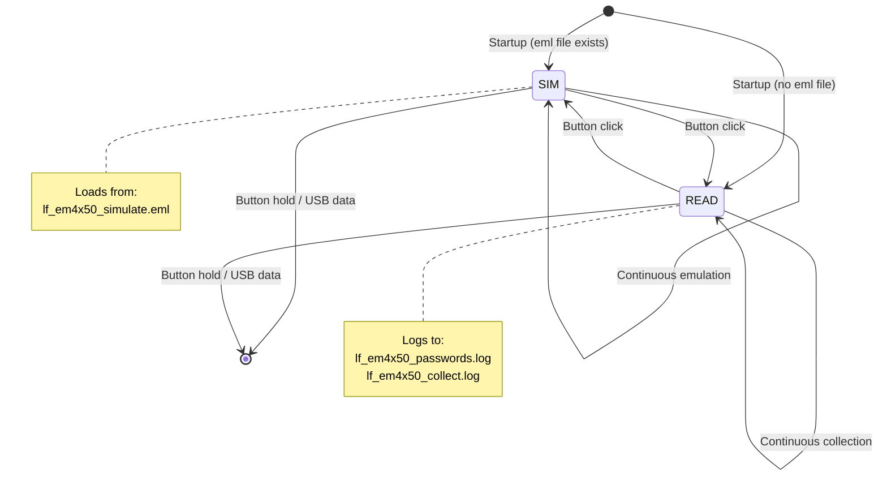

# LF_THAREXDE — EM4x50 Simulator/Collector

> **Author:** tharexde
> **Frequency:** LF (125 kHz)
> **Hardware:** RDV4 (requires flash memory)

[Back to Standalone Modes Index](../../armsrc/Standalone/readme.md#individual-mode-documentation) | [Source Code](../../armsrc/Standalone/lf_tharexde.c) | [Development Guide](../../armsrc/Standalone/readme.md#developing-standalone-modes)

---

## What

A dual-mode standalone for EM4x50 tags: simulate an EM4x50 tag loaded from a flash dump file, or read/collect EM4x50 data (including passwords) to flash.

## Why

EM4x50 is a more advanced LF tag than EM4100 — it supports password protection, memory blocks, and bidirectional communication. This mode handles both offensive and defensive EM4x50 scenarios:

- **Simulation**: Load a dumped EM4x50 tag and emulate it at a reader
- **Collection**: Capture EM4x50 data and passwords from cards in the field

## How

**SIM mode:**
1. Loads tag data from `lf_em4x50_simulate.eml` on flash
2. Configures the EM4x50 simulation engine
3. Continuously emulates the tag

**READ mode:**
1. Listens for EM4x50 tags
2. Reads all accessible memory blocks
3. If password authentication is observed, logs it to `lf_em4x50_passwords.log`
4. Full tag dumps go to `lf_em4x50_collect.log`

## LED Indicators

| LED | Meaning |
|-----|---------|
| **A** (solid) | Simulating (blinks if no data or error) |
| **B** (solid) | Reading / recording |
| **D** (solid) | Unmounting / syncing flash |

## Button Controls

| Action | Effect |
|--------|--------|
| **Single click** | Toggle between SIM and READ modes |
| **Hold** | Exit to shell |
| **USB command** | Exit standalone mode |

## State Machine



## Flash Files

| File | Purpose |
|------|---------|
| `lf_em4x50_simulate.eml` | Input: tag data to simulate |
| `lf_em4x50_passwords.log` | Output: captured passwords |
| `lf_em4x50_collect.log` | Output: full tag dumps |

## Compilation

```
make clean
make STANDALONE=LF_THAREXDE -j
./pm3-flash-fullimage
```

## Related

- [EM4100 RSWB](lf_em4100rswb.md) — EM4100 (simpler format) multi-tool
- [IceHID Collector](lf_icehid.md) — Multi-format LF collector
- [NexID Collector](lf_nexid.md) — Nexwatch collector
