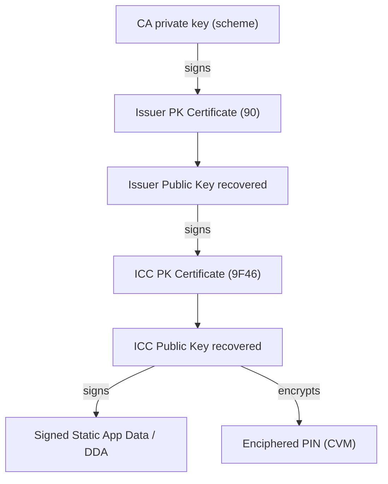

# SPEC: Cryptography, CAPKs, and Key Recovery

## Purpose

Document how the PM3 EMV stack performs offline data authentication (ODA), PIN encipherment, ARQC/ARPC handling, and where keys live — so terminal emulator work extends existing `emv_pki.c` / `crypto.c` correctly.

## Scope

- CA / Issuer / ICC public key recovery (SDA, DDA, CDA)
- CAPK provisioning (`client/resources/capk.txt`)
- PIN VERIFY and enciphered PIN blocks
- ARPC generation/validation (lab / test keys)
- Interac / Visa / MC test key material

## Non-Goals

- Issuer master key management in production HSMs
- PIN encryption for live online authorization to acquirer

---

## Key Hierarchy (EMV Book 2)



---

## CAPK Storage in Proxmark3

### File format

`client/resources/capk.txt` — one key per line, [lumag/emv-tools](https://github.com/lumag/emv-tools) format:

```text
<RID 5 bytes colon-separated> <index hex> <expiry YYMMDD|000000> rsa <exponent> <modulus colon-separated> sha1 <checksum>
```

Example:

```text
a0:00:00:00:03 94 000000 rsa 03 ac:d2:b1:23:... sha1 c4:a3:c4:3c:...
```

### Loading path

`emv_pk_get_ca_pk()` in `client/src/emv/emv_pk.c`:

1. `searchFile(..., RESOURCES_SUBDIR, "capk", ".txt")` → finds `capk.txt`
2. Match RID + index from card tag `8F` (CA PKI) / `9F22`
3. `emv_pk_verify()` checks SHA-1 checksum

### REQ-FW-KEY-001

Terminal emulator shall use existing `get_ca_pk(tlvdb)` — no duplicate CAPK store.

### REQ-FW-KEY-002

Interac test CAPKs (RID `A000000277`, index `03` and `07`) shall be present in `capk.txt` for Canadian test cards.

---

## CAPK Reference Table (test / lab)

| RID | Scheme | Index | Size | In capk.txt | Test card use |
|-----|--------|-------|------|-------------|---------------|
| `A000000003` | Visa | `92`, `94`, `95` | 1408/1984 | Yes | EMVCo / Worldpay test |
| `A000000003` | Visa | `08`, `09` | 1408 | Yes | Dated production-style |
| `A000000004` | Mastercard | `EF`, `F1` | 1984/1408 | Yes | MC test |
| `A000000004` | Mastercard | `00`–`06`, `F3`–`FA` | various | Yes | MC test matrix |
| `A000000277` | Interac | `03` | 1408 | **Added** | Interac Flash TC02–04 |
| `A000000277` | Interac | `07` | 1984 | **Added** | Interac Flash TC01 |

Production keys rotate via EMV Parameter Management updates (Visa index `08`, MC `05`, etc.) — do not assume test indices work on live cards.

Sources: Worldpay EMV Network Keys Test PDF; Interac Flash test card doc §4.

---

## Offline Data Authentication — Recovery Flow

Implemented in `client/src/emv/emv_pki.c`, invoked from `emvcore.c`:

| Method | AIP bits | Functions | Output |
|--------|----------|-----------|--------|
| SDA | b6 | `trSDA` → `emv_pki_recover_issuer_cert` | Static data authenticated |
| DDA | b7 | `EMVGenerateChallenge`, `EMVInternalAuthenticate`, `trDDA` | ICC dynamic sig verified |
| fDDA (qVSDC) | contactless | `trDDA` fast path | Same, simplified UN |
| CDA | `--qvsdccda` | `trCDA` → `emv_pki_perform_cda` | Combined DDA + GEN AC |

### REQ-CRYPT-010

Terminal phase `phase_oda.c` shall call existing `trSDA` / `trDDA` / `trCDA` without reimplementing RSA.

### REQ-CRYPT-011

On missing CAPK, terminal shall log RID+index and suggest adding key to `capk.txt` or `--capk-extra <file>`.

### Key recovery chain (developer checklist)

1. Read `8F` → CA index; load CAPK
2. Read `90` Issuer PK cert → `emv_pki_recover_issuer_cert`
3. Read `9F46`/`9F48` ICC cert → `emv_pki_recover_icc_cert`
4. For enciphered PIN: read `9F2D`/`9F2E`/`9F2F` → `emv_pki_recover_icc_pe_cert`

---

## PIN Verification

### Plaintext offline PIN

APDU:

```text
CLA INS P1 P2 Lc [PIN block] Le
00  20  00  80  08  [8 bytes format 2]  (none)
```

PIN block ISO 9564-1 Format 2:

```text
2L PP PP PP PP PP/FF ...
  L = PIN length (4 bits) | 0x2
  P = BCD PIN digits, padded with F
```

Example PIN `1234`:

```text
24 12 34 FF FF FF FF FF
```

### Enciphered offline PIN

1. Recover ICC PIN encipherment PK from card (`9F2D` certificate chain)
2. Build format 2 PIN block
3. RSA encrypt with ICC PIN PK (PKCS#1 v1.5 padding)
4. VERIFY with enciphered block in command data

Reference: EMV Book 3 §11.5; lumag/emv-tools `emv_verify.c`.

### REQ-CRYPT-020

`phase_cvm.c` shall implement VERIFY for CVM codes `01` (plain) and `04` (enciphered offline).

### REQ-CRYPT-021

PIN buffer zeroized per REQ-SEC-001 after VERIFY completes.

---

## ARQC and ARPC (Online / Lab)

### Generate AC (card → terminal)

Terminal sends CDOL1 data via `80 AE` / `EMVAC`:

| P1 | Request |
|----|---------|
| `00` | AAC (decline) |
| `40` | TC (offline approve) |
| `80` | ARQC (online) |

Card returns tag `9F26` (AC), `9F36` (ATC), `9F27` (CID), `9F10` (IAD).

### ARPC (issuer → card)

When Crypto Version = 10 (Visa CVN 10-style), ARPC is derived from ARQC and Authorization Response Code (ARC, tag `8A`):

```text
ARPC = ARQC XOR padding(ARC)   // simplified lab view in cmdemv.c today
```

Full EMV uses issuer session key + DES/3DES per scheme (Visa CVN 10/18, MC UCAF variants).

**Current PM3 gap** (`cmdemv.c` ~2007–2029): XOR stub only; comment "don't know bank keys".

### REQ-CRYPT-030

`phase_online.c` shall support **manual ARPC** via `--arpc <hex>` for EXTERNAL AUTHENTICATE.

### REQ-CRYPT-031

For **Interac test cards**, host stub shall use master key `0123456789ABCDEFFEDCBA9876543210` to validate ARQC and compute ARPC per Interac issuer simulator doc.

### REQ-CRYPT-032

External authenticate APDU after online:

```text
00 82 00 00 Lc [Issuer Authentication Data tag 91 data]
```

IAD = `ARPC (8 bytes) || ARPC-RC (2 bytes)` for Interac.

### ARPC-RC Interac reference

Recommended contact value: **`8840`** (byte1 bits 6,5,3 = 0 → no block flags).

---

## Issuer Script Keys (71/72)

Scripts are encrypted card–issuer traffic; terminal **relays** APDU templates from tag `71`/`72` without decrypting.

Interac test keys SMI/SMC (same 16-byte test key as AC master) used in issuer simulator for script MAC/confidentiality on test cards.

REQ-CRYPT-040: Terminal shall transmit script commands sequentially; set TVR script fail bits on SW error (Book 3 §6.10).

---

## Test Key Files (external)

| File | Source |
|------|--------|
| `client/resources/capk.txt` | Bundled CA keys |
| `docs/emv-terminal-emulator/examples/interac_test_keys.json` | Interac AC/SMI/SMC + PINs |
| lumag `data/visa-test.keys` | Additional Visa test CAPKs |
| lumag `data/mastercard-test.keys` | Additional MC test CAPKs |

---

## Acceptance Criteria

AC-CRYPT-001: `get_ca_pk` finds Interac index `03` after capk.txt update; verify checksum passes.

AC-CRYPT-002: Plain PIN VERIFY on test card returns SW `9000` and updates `9F34`.

AC-CRYPT-003: Manual `--arpc` completes EXTERNAL AUTHENTICATE with SW `9000` on test card.

---

## Test Coverage

| ID | Test |
|----|------|
| AUTO-CRYPT-001 | CAPK parse all lines in capk.txt |
| AUTO-CRYPT-002 | PIN format 2 builder vectors |
| AUTO-CRYPT-003 | ARPC XOR lab stub matches cmdemv reference |
| MAN-CRYPT-001 | Interac TC01 contact PIN + online ARPC `8840` |

---

## Open Questions

OQ-012: Ship lumag supplemental `.keys` merged into capk.txt vs separate `--capk` flag?

OQ-013: Implement full Visa CVN 10 ARPC or manual entry only for v1?
